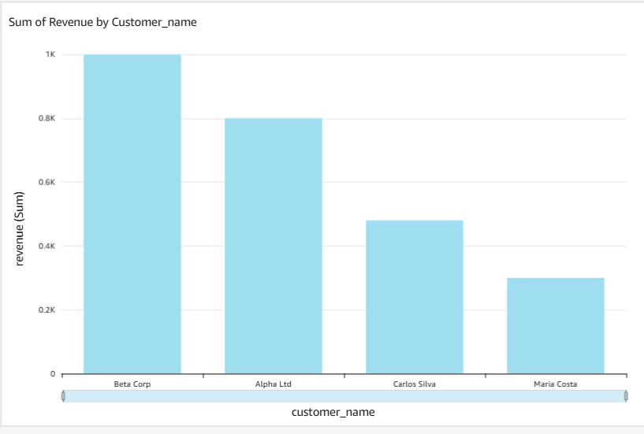
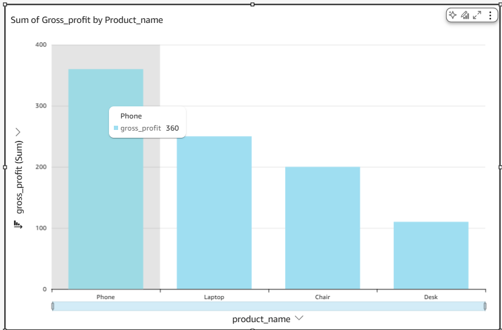

# QuickSight Dashboards – Finance Analytics

This repository contains Amazon QuickSight dashboards built from curated finance datasets. The goal is to showcase clear, decision‑ready visualisations and a clean, reproducible project structure.

---

## 📊 Dashboards

### 1. Revenue Dashboard

**What it shows**

* Total revenue over time
* Revenue by customer
* Revenue trends and seasonality

**Preview**




---

### 2. Gross Profit Dashboard

**What it shows**

* Gross profit over time
* Margin analysis
* Comparison between revenue and cost drivers

**Preview**



---

## 📁 Repository Structure

```
.
├── data/            # Source and processed datasets
├── sql/             # SQL queries (Athena / analysis)
├── dashboards/      # QuickSight dashboard definitions or exports
├── images/          # Dashboard screenshots used in the README
├── README.md
└── .gitignore
```

---

## 🔄 Data Flow (End‑to‑End)

This project follows a simple, production‑style AWS analytics pipeline:

```
CSV / source data
      ↓
Amazon S3 (raw & curated data)
      ↓
Amazon Athena (SQL queries & aggregations)
      ↓
Amazon QuickSight (dashboards & KPIs)
```

**Flow explanation**

* Raw finance data is stored in **Amazon S3**
* **Athena** is used to query and aggregate data using SQL (no servers required)
* Cleaned datasets are visualised in **QuickSight**
* Dashboard screenshots are exported and documented in this repository

---

## 🛠️ Tools & Technologies

* **AWS QuickSight** – data visualisation
* **Amazon Athena** – SQL analysis
* **Amazon S3** – data storage
* **SQL** – data transformation and aggregation

---

## 🎯 Purpose

This project is part of a finance / cloud analytics portfolio. It demonstrates:

* Practical use of AWS analytics services
* Financial KPI design (revenue, gross profit, margins)
* Clear documentation and reproducible structure

---

## 🚀 Next Improvements

* Add cost breakdown dashboard
* Parameterised filters in QuickSight
* Automated data refresh documentation

---

## 👤 Author

Fernando Ferraz
Economics & Finance | Cloud Analytics | AWS Certified

